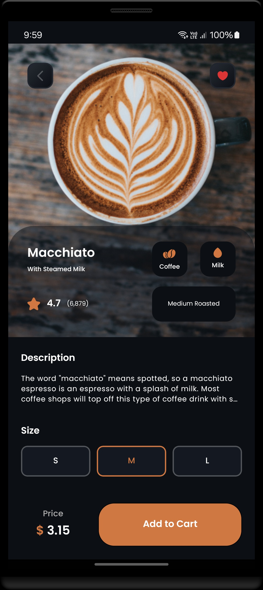
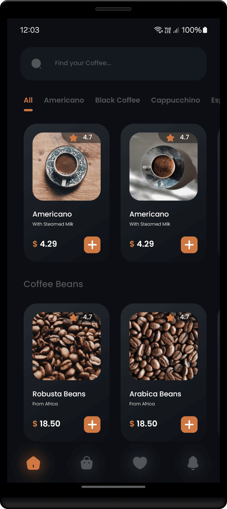
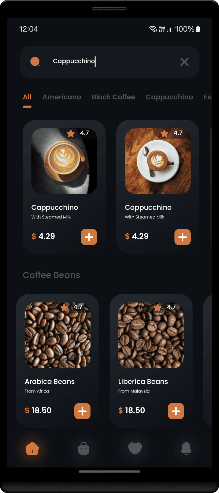

<h1 align="center" >  
CoffeeLab by Nova <br> 
♨ [ ʀᴇᴀᴄᴛ ɴᴀᴛɪᴠᴇ ᴘʀᴏᴊᴇᴄᴛ ] ♨
</h1>


## Stage 10: Implement Detail Screen  
**Log:** January 22, 2025  

This stage focuses on creating and integrating the `DetailScreen` with required UI components and navigation parameters.  


<p align="center">  
· • —–—–—– ٠ ✦ ٠ —–—–—– • ·
</p>

---

## Step by Step Process

### Task 1: Initial Implementation of `DetailScreen` 
Set up the basic structure for the detail screen file.  
- **Path:** [DetailScreen.tsx](./src/screens/DetailScreen.tsx)  

#
### Task 2: Add Navigation Log  
Add a log to verify route parameters are received correctly when navigating to the screen.  
Note:  
add a log to check screen retrieves params correctly:  
```ts
navigation.push("Details", {  
  index: item.index,  
  id: item.id,  
  type: item.type,  
});  
``` 

Log Example:  
```ts
const DetailScreen = ({ navigation, route }: any) => {  
  console.log("route params : ", route.params);  
  ...
}  
```  

#
### Task 3: Create `ImageBackdropInfo` Component  
Create a reusable component for displaying an image and info in the header.
- **Path:** [ImageBackdropInfo.tsx](./src/components/ImageBackdropInfo.tsx)  

#
### Task 4: Create `PaymentFooter` Component  
Develop a reusable footer component to show prices and navigation buttons.
- **Path:** [PaymentFooter.tsx](./src/components/PaymentFooter.tsx)  

#
### Task 5: Integrate Components into `DetailScreen`  
- Add `ImageBackdropInfo` for the header view and `PaymentFooter` for footer navigation.  

#
### Task 6: Finalize UI and Functional Components  
- Implement all remaining UI elements and logic within `DetailScreen`.  
- **Path:** [DetailScreen.tsx](./src/screens/DetailScreen.tsx)  

---
<br/>

#
#### Final Steps  

1. Ensure the app works correctly by cleaning and rebuilding the project:

   ```bash
   cd android
   ./gradlew clean
   cd ..
   npx react-native run-android
   ```

<br/>


<h2 align="center" > 
 —–— ◇ —–—  <br/>
ʟᴀᴛᴇꜱᴛ ꜱᴄʀᴇᴇɴꜱʜᴏᴛꜱ
</h2> 

<p align="center">  
  


</p>

<p align="center"> 
 —–— ◇ —–— 
</p>

<p align="center">  
  

  
  
</p>  

<br/>

---

<h4 align="center" >  
See you in the next step for the development process! 🚀
</h4> 

---
