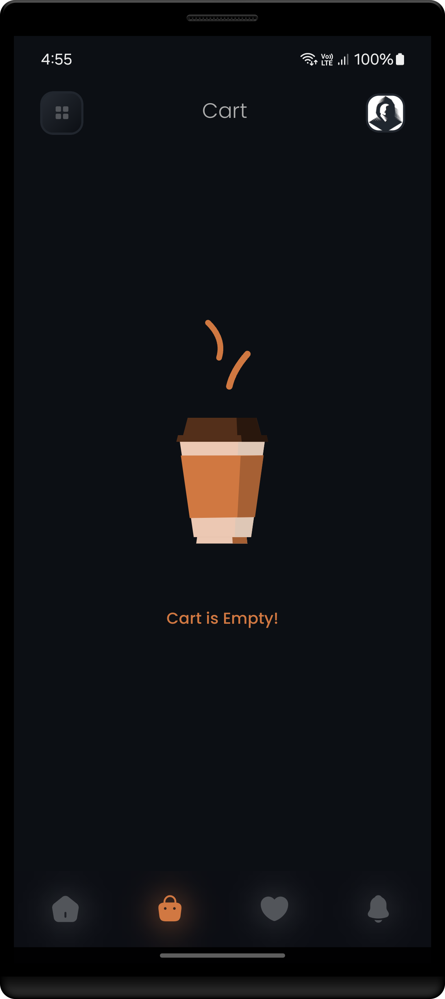
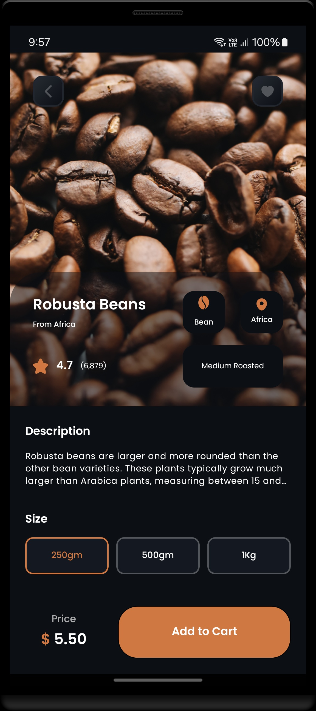

<h1 align="center" >  
CoffeeLab by Nova <br> 
♨ [ ʀᴇᴀᴄᴛ ɴᴀᴛɪᴠᴇ ᴘʀᴏᴊᴇᴄᴛ ] ♨
</h1>


## Stage 11: Implement Cart Screen  
**Log:** January 23, 2025  

This stage focuses on adding cart functionality and implementing the `CartScreen`. 


<p align="center">  
· • —–—–—– ٠ ✦ ٠ —–—–—– • ·
</p>

---

## Step by Step Process

### Task 1: Add "Add to Cart" Functionality  
Implement logic for adding items to the cart via buttons in `HomeScreen`.  
- **Path:** [HomeScreen.tsx](./src/screens/HomeScreen.tsx)  

#
### Task 2: Log Cart Parameters  
Log cart parameters to verify that items are correctly added to the cart.  

```ts
addToCart({  
  id,  
  index,  
  name,  
  type,  
  roasted,  
  imageLinkSquare,  
  specialIngredient,  
  prices: [{ ...price, quantity: 1 }],  
});  
calculateCartPrice();  
navigation.navigate("Tab", { screen: "Cart" });  
``` 

Log Example in `CartScreen`:  

```tsx
const CartScreen = () => {  
  const cartList = useStore((state: any) => state.cartList);  
  console.log("CartList size: ", cartList.length);  
  console.log("CartList >>>>", cartList);  
  ...
};  
```  

#
### Task 3: Update `useStore` with Cart Actions  
Add cart action functions to `cartActions` and integrate them into the `useStore` hook.  
- **Path (cart actions):** [cartActions.ts](./src/store/util/cartActions.ts)  
- **Path (store hook):** [useStore.ts](./src/store/useStore.ts)  

#
### Task 4: Apply Components to `CartScreen`  
Integrate reusable components like `CartItem` and `PaymentFooter` into `CartScreen`.  

#
### Task 5: Finalize UI and Functional Components  
Implement all required UI and functionality for the `CartScreen`.  
- **Path:** [CartScreen.tsx](./src/screens/CartScreen.tsx)  


<br/>

---

#### Final Steps  

1. Ensure the app works correctly by cleaning and rebuilding the project:

   ```bash
   cd android
   ./gradlew clean
   cd ..
   npx react-native run-android
   ```

<br/>


<h2 align="center" > 
 —–— ◇ —–—  <br/>
ʟᴀᴛᴇꜱᴛ ꜱᴄʀᴇᴇɴꜱʜᴏᴛꜱ
</h2> 

<p align="center">  
  


</p>

<p align="center"> 
 —–— ◇ —–— 
</p>

<p align="center">  
  

  
  
</p>  

<br/>

---

<h4 align="center" >  
See you in the next step for the development process! 🚀
</h4> 

---
