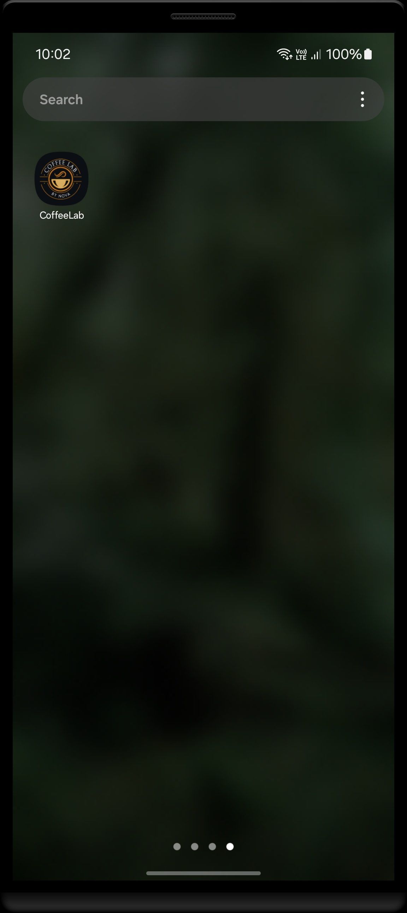
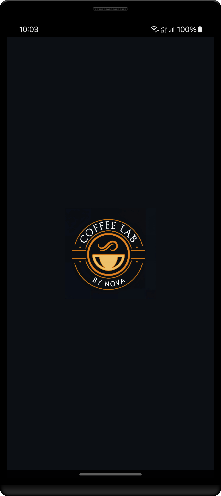
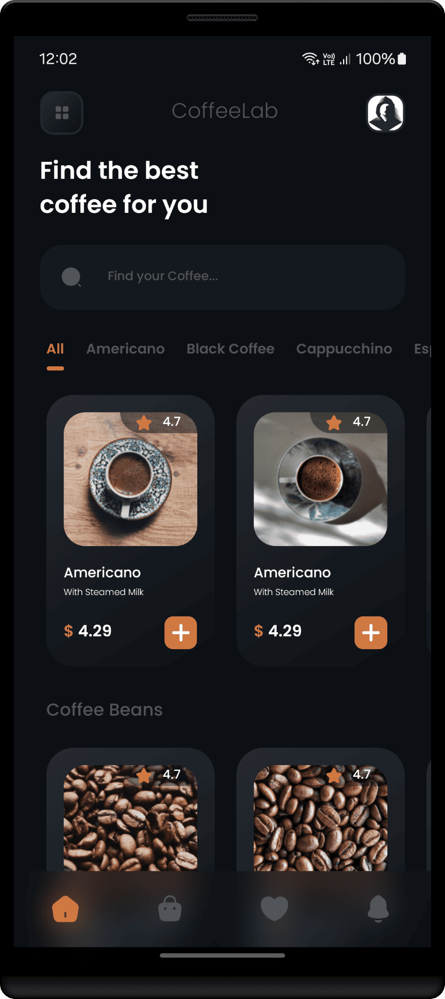
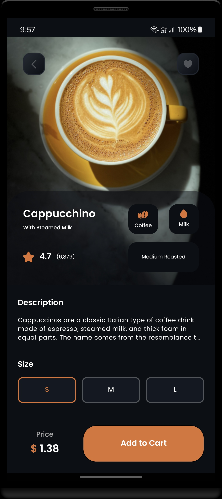
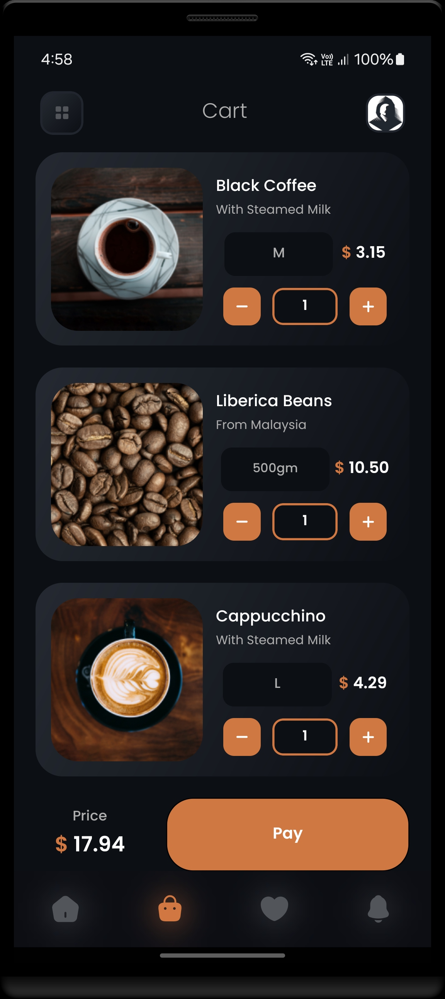
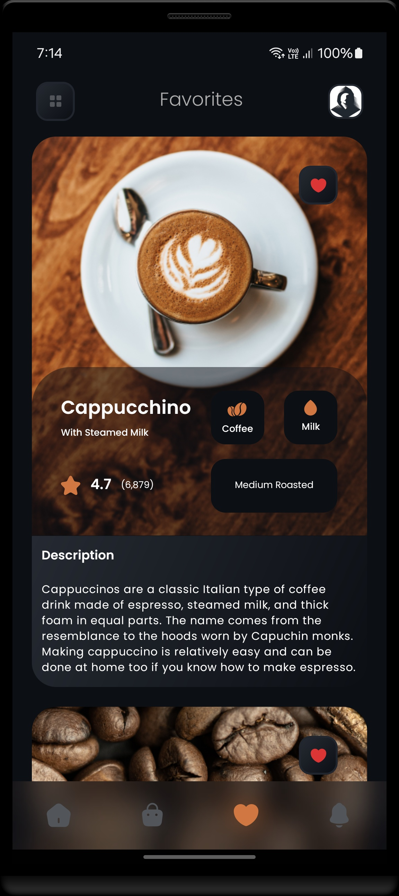
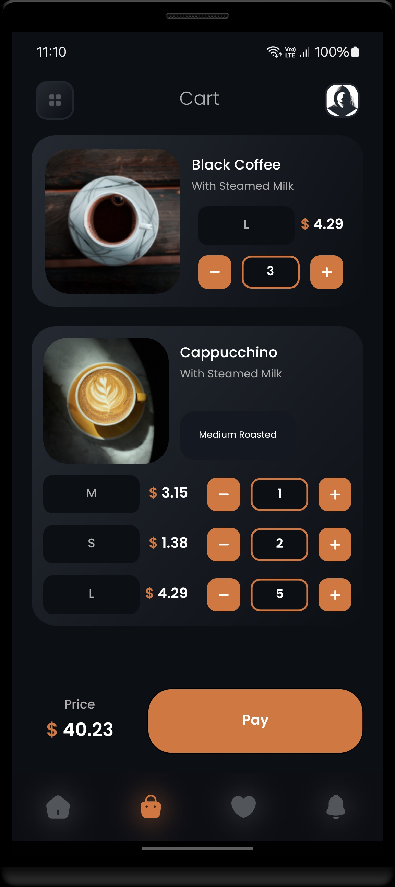
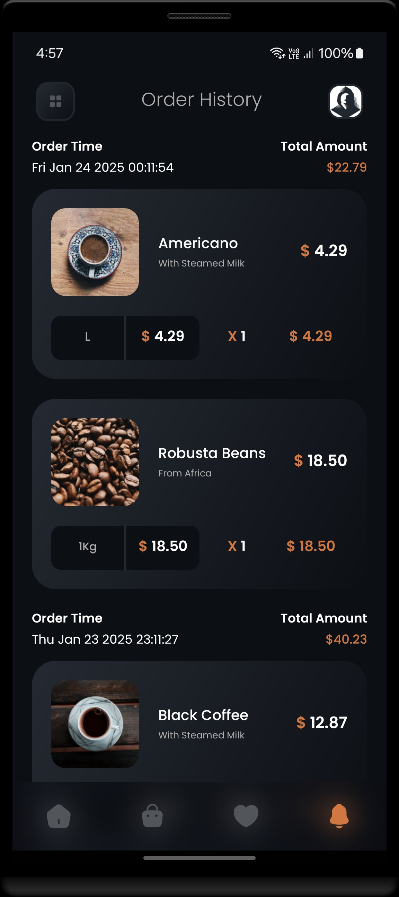
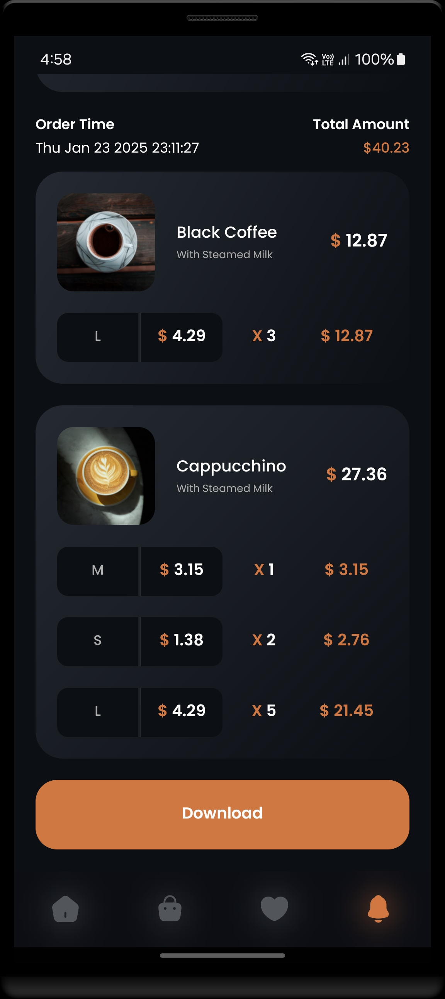

<h1 align="center" >  
CoffeeLab by Nova <br> 
♨ [ ʀᴇᴀᴄᴛ ɴᴀᴛɪᴠᴇ ᴘʀᴏᴊᴇᴄᴛ ] ♨
</h1>


## Stage 15: Implement Splash Screen  
**Log:** January 24, 2025  

This stage focuses on adding a splash screen for Android, configuring it with a custom layout, and ensuring the app transitions seamlessly.  

<p align="center">  
· • —–—–—– ٠ ✦ ٠ —–—–—– • ·
</p>

---

## Step by Step Process

### Task 1: Install Splash Screen Plugin  
Install the `react-native-splash-screen` package to handle the splash screen functionality.  
```
https://www.npmjs.com/package/react-native-splash-screen
```

- Command:  
``` 
npm i react-native-splash-screen --save  
``` 
 
#
### Task 2: Configure `MainActivity.kt`  
Add splash screen initialization in the `MainActivity.kt` file.  

[MainActivity.kt](./android/app/src/main/java/com/coffeelab/MainActivity.kt)  
- **Snippet:**  
```kotlin 
import android.os.Bundle;  //here
import org.devio.rn.splashscreen.SplashScreen;  //here

override fun onCreate(savedInstanceState: Bundle?) {  
    SplashScreen.show(this);  //here
    super.onCreate(null);  
}  
``` 

#
### Task 3: Create Splash Screen Layout  
Set up a `launch_screen.xml` file in `app/src/main/res/layout` for the splash screen UI.  

- **Content:**  
[launch_screen.xml](./android/app/src/main/res/layout/launch_screen.xml) 
```xml  
<RelativeLayout xmlns:android="http://schemas.android.com/apk/res/android"  
    android:layout_width="match_parent"  
    android:layout_height="match_parent"  
    android:background="@color/primary_dark">  

    <ImageView  
        android:layout_width="170dp"  
        android:layout_height="170dp"  
        android:src="@drawable/launch_screen"  
        android:layout_centerInParent="true" />  

</RelativeLayout>  
``` 

- **Add to Colors Resource File:**  
[color.xml](./android/app/src/main/res/values/color.xml) 
```xml 
<resources>  
    <color name="primary_dark">#0C0F14</color>  
</resources>  
```  

#
### Task 4: Hide Splash Screen After Load  
Modify `App.tsx` to hide the splash screen once the app has loaded.  
- **Snippet:**  
```tsx  
import SplashScreen from 'react-native-splash-screen'; 

...

useEffect(() => {  
    SplashScreen.hide();  
}, []);  
```  

#
### Task 5: Generate and Apply App Icons  
1. **Create App Icons:**  
   - Upload your logo with background color `#0C0F14` to [App Icon Generator](https://www.appicon.co/#image-sets)  
   - Download the generated Android icons (mdpi, hdpi, xhdpi, xxhdpi, xxxhdpi) and copy them to `android/app/src/main/res`  

2. **Create Launcher Icons:**  
   - Use [Icon Kitchen](https://icon.kitchen/) to generate launcher icons.  
   - Rename a copy of `ic_launcher.png` to `ic_launcher_round.png` in each drawable folder  


<br/>

---

### Final Steps  

**♨ Clean and Build the Project: ♨ ♨** <br/>
 Cleaning and rebuilding ensures that any cached or stale data is removed, providing a clean state for the build process. 

<br/>

 Note:  <br/>
Main command for `Release build install`:
```bash
./gradlew installRelease
```
<br/>

Full command:
```bash
cd android
./gradlew clean
./gradlew installRelease
cd ..
```


<br/>

1. **Debugging Commands:**
   - **View stacktrace for build issues:**
     Use this command to identify the root cause of build failures with detailed logs:
     ```bash
     ./gradlew installRelease --stacktrace
     ```
   
   - **Check dependencies:**
     Generate a dependency tree to identify conflicts or duplicates in your project:
     ```bash
     ./gradlew app:dependencies
     ```
   
   - **Configure `gradle.properties`:**
     Ensure the following settings are included in your `gradle.properties` file to migrate and use AndroidX libraries:
     ```properties
     android.useAndroidX=true
     android.enableJetifier=true
     ```

2. **Test on Metro if Needed:**
   - For debugging and testing the app using React Native's Metro bundler, use these commands:
     ```bash
     cd android
     ./gradlew clean
     cd ..
     npx react-native run-android
     ```
   - This approach is useful for checking runtime behavior and ensuring the app works as expected during development.


<br/>


<h2 align="center" > 
 —–— ◇ —–—  <br/>
ʟᴀᴛᴇꜱᴛ ꜱᴄʀᴇᴇɴꜱʜᴏᴛꜱ
</h2> 

<p align="center">  
  

</p>

<p align="center"> 
 —–— ◇ —–— 
</p>

<p align="center">  
  

  
  
</p>  

<p align="center">  
  

  
  
</p>  

<br/>

---

<h4 align="center" >  
See you in the next step for the development process! 🚀
</h4> 

---
