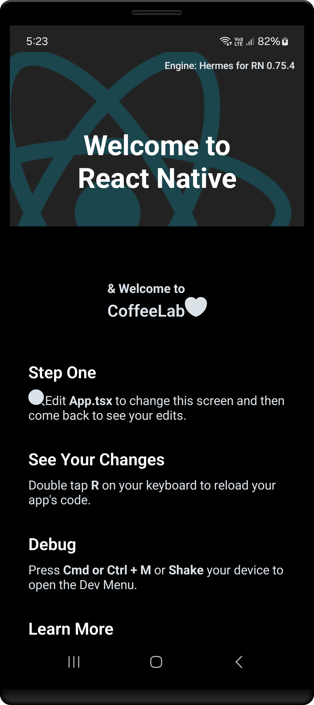

<h1 align="center" >  
CoffeeLab by Nova <br> 
♨ [ ʀᴇᴀᴄᴛ ɴᴀᴛɪᴠᴇ ᴘʀᴏᴊᴇᴄᴛ ] ♨
</h1>


## Stage 05: Custom Icon Setup  
**Log:** January 19, 2025  

This stage sets up custom icons using IcoMoon, allowing you to use personalized icons in your project.

---

## Step by Step Process

#### Step 1: Create a Custom Icon Component

1. Inside the `src/components` directory, create a file named `CustomIcon.ts`.
2. Implement the following code in the file:

   ```js
   import {createIconSetFromIcoMoon} from 'react-native-vector-icons';
   import icoMoonConfig from '../../selection.json';
   export default createIconSetFromIcoMoon(icoMoonConfig);
   ```

3. Reference: [CustomIcon.ts](./src/components/CustomIcon.ts)  

This allows you to use custom icons based on your IcoMoon configuration.

---

#### Step 2: Using the Custom Icon Component

You can now use the custom icon component like this:

```jsx
<CustomIcon name="search" size={24} />
```

4. Test it by adding the component in [App.tsx](./App.tsx):

Example code in `App.tsx`:

```jsx
<Section title="Step One">
    <CustomIcon name="search" size={24} />
    Edit <Text style={styles.highlight}>App.tsx</Text> to change this
    screen and then come back to see your edits.
</Section>
```

Feel free to try out different icons or configurations.

---

### Final Steps

After adding and testing the custom icon, ensure the app is functioning as expected by cleaning and rebuilding the project:

1. Run the following commands:

   ```bash
   cd android
   ./gradlew clean
   cd ..
   npx react-native run-android
   ```

---

### Screenshot  

<p align="center" >  

</p>  


---

**That's all for this stage!**  
Check that everything is working smoothly before proceeding to the next step. 🚀

---