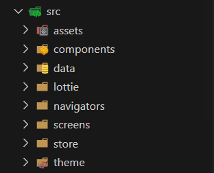
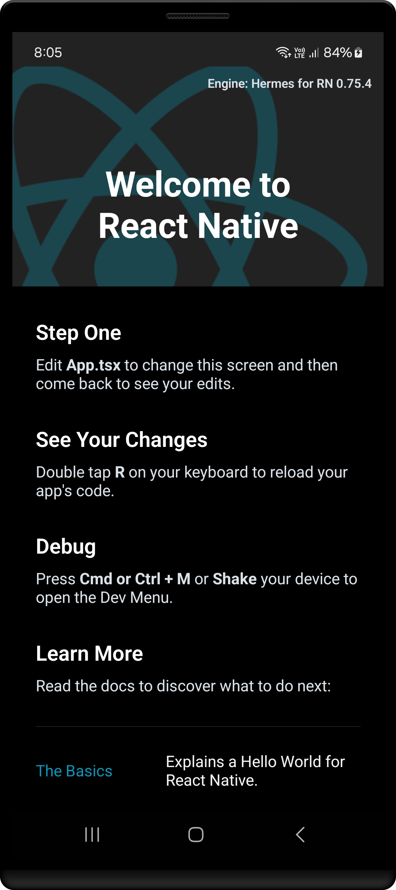

<h1 align="center" >  
CoffeeLab by Nova <br> 
♨ [ ʀᴇᴀᴄᴛ ɴᴀᴛɪᴠᴇ ᴘʀᴏᴊᴇᴄᴛ ] ♨
</h1>

## Stage 04: Data, Theme, and Structural Setup  
**Log:** January 19, 2025  

This stage focuses on setting up the data sources, theme configuration, and folder structure for the project.

---

## Step by Step Process

#### Step 1: Data Sources

1. Inside the `src` directory, create a folder named `data`  
2. Allocate the data sources for the project:

   - [CoffeeData.ts](./src/data/CoffeeData.ts)  
   - [BeansData.ts](./src/data/BeansData.ts)

---

#### Step 2: Theme Configuration

1. Inside the `src` directory, create a folder named `theme`.  
2. Configure the theme settings for the project:

   - [theme.ts](./src/theme/theme.ts)

---

#### Step 3: Folder Structure

1. Inside the `src` directory, create the following folders:  

   - `components` : for reusable UI components
   - `navigators` : for managing app navigation
   - `store` : for state management library
   - `screens` : for app screens and views

   Example folder structure:  
   <p align="left">  
     
   </p>

---

### Final Steps

After setting up the data, theme, and folder structure, ensure the app is working as expected by cleaning and rebuilding the project:


1. Run the following commands:

   ```bash
   cd android
   ./gradlew clean
   cd ..
   npx react-native run-android
   ```

---

### Screenshot  

<p align="center" >  

</p>  

---
**See you in the next step for the development process! 🚀** 

---

