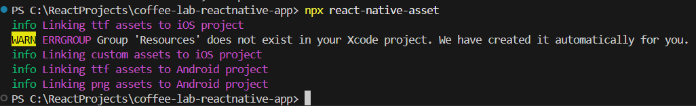

<h1 align="center" >  
CoffeeLab by Nova <br> 
♨ [ ʀᴇᴀᴄᴛ ɴᴀᴛɪᴠᴇ ᴘʀᴏᴊᴇᴄᴛ ] ♨
</h1>

## Stage 03: Asset Allocation  
**Log:** January 18, 2025  

In this stage, we will allocate assets such as images, fonts, and animations into the project. We will also configure the project to link those assets correctly.

---

## Step by Step Process

#### Step 1: Create Asset Folders and Allocate Assets

1. Create a `src` folder in the root directory.
2. Inside `src`, create an `assets` folder, and store project images and fonts. <br/>
   👉 [View the `assets` folder](./src/assets/)  
3. Inside `src`, create another folder named `lottie` , and store animation JSON files. <br/>
   👉 [View the `lottie` folder](./src/lottie/)  
4. Add a `selection.json` file to the root directory for configuration. <br/>
   👉 [View the `selection.json` ](./selection.json)  

---

#### Step 2: Configure React Native to Use Assets

1. Create a `react-native.config.js` file in the root directory with the following content:

   ```js
   module.exports = {
       project: {
           ios: {},
           android: {},
       },
       assets: ['./src/assets'],
   };
   ```

2. To export the assets to both Android and iOS, run the following command:  
   ```bash
   npx react-native-asset
   ```

---



---

### Final Steps

After allocating the assets, ensure the app is still working as expected by cleaning and rebuilding the project:

1. Run the following commands:

   ```bash
   cd android
   ./gradlew clean
   cd ..
   npx react-native run-android
   ```

---

### Screenshot  

<p align="center" >  

</p>  

---
**See you in the next step for the development process! 🚀** 

---

