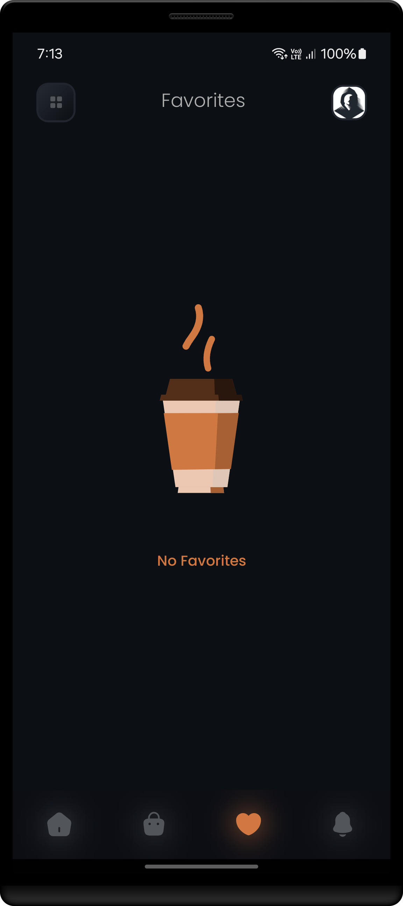
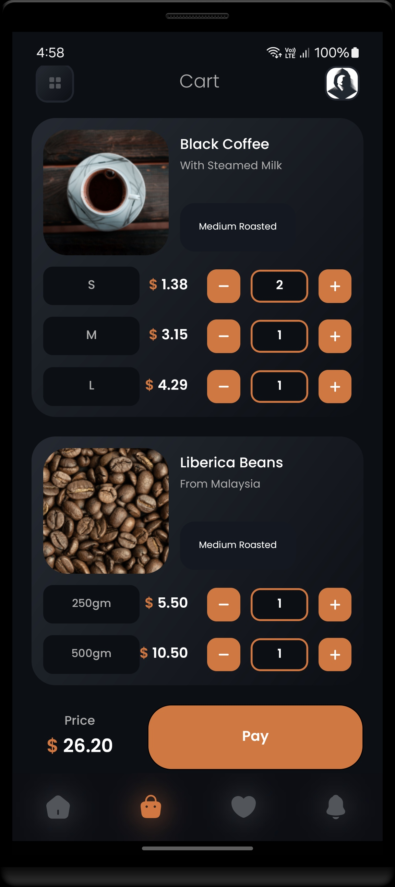

<h1 align="center" >  
CoffeeLab by Nova <br> 
♨ [ ʀᴇᴀᴄᴛ ɴᴀᴛɪᴠᴇ ᴘʀᴏᴊᴇᴄᴛ ] ♨
</h1>


## Stage 12: Implement Favorite Screen  
**Log:** January 23, 2025  

This stage focuses on creating and integrating the `FavoriteScreen` with all necessary components and functionality.  


<p align="center">  
· • —–—–—– ٠ ✦ ٠ —–—–—– • ·
</p>

---

## Step by Step Process

### Task 1: Initialize `FavoriteScreen`  
Set up the initial UI and functionality for the `FavoriteScreen`.  
- **Path:** [FavoriteScreen.tsx](./src/screens/FavoriteScreen.tsx)  

#
### Task 2: Implement `FavoriteItemCard` Component  
Create a reusable `FavoriteItemCard` component for displaying favorite items on the screen.  
- **Path:** [FavoriteItemCard.tsx](./src/components/FavoriteItemCard.tsx)  

#
### Task 3: Complete `FavoriteScreen` Implementation  
Add all UI elements and functionality to fully implement the `FavoriteScreen`.  
- **Path:** [FavoriteScreen.tsx](./src/screens/FavoriteScreen.tsx)  

<br/>

---

#### Final Steps  

1. Ensure the app works correctly by cleaning and rebuilding the project:

   ```bash
   cd android
   ./gradlew clean
   cd ..
   npx react-native run-android
   ```

<br/>


<h2 align="center" > 
 —–— ◇ —–—  <br/>
ʟᴀᴛᴇꜱᴛ ꜱᴄʀᴇᴇɴꜱʜᴏᴛꜱ
</h2> 

<p align="center">  
  

</p>

<p align="center"> 
 —–— ◇ —–— 
</p>

<p align="center">  
  

  
  
</p>  

<br/>

---

<h4 align="center" >  
See you in the next step for the development process! 🚀
</h4> 

---
