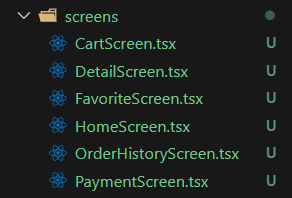
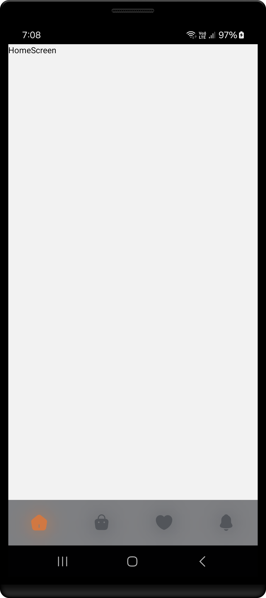

<h1 align="center" >  
CoffeeLab by Nova <br> 
♨ [ ʀᴇᴀᴄᴛ ɴᴀᴛɪᴠᴇ ᴘʀᴏᴊᴇᴄᴛ ] ♨
</h1>


## Stage 06: Stack and Tab Navigators  
**Log:** January 19, 2025  

This stage involves setting up Stack and Tab Navigators in your React Native app for navigating between different screens.

---

## Step by Step Process

#### Step 1: Clear App.tsx

1. Delete everything from `App.tsx`:  
   - [App.tsx](./App.tsx)

2. Type `rnfes` for start impl. (this requires the ES7+ React/Redux/React-Native snippets plugin).

---

#### Step 2: Create Screens

1. Inside `src/screens/`, create the following six screens and initialize them with `rnfes`:

   - CartScreen
   - DetailScreen
   - FavoriteScreen
   - HomeScreen
   - OrderHistoryScreen
   - PaymentScreen

   <p align="left">  
   
   </p>  

---

#### Step 3: Create Tab Navigator

1. Inside `src/navigator/`, create a file named `TabNavigator.tsx` and implement the following code:

   - [TabNavigator.tsx](./src/navigator/TabNavigator.tsx)

   **Highlights**  
   **Tab Navigator Creation:**
   - A bottom tab navigator (`createBottomTabNavigator`) is created with the `Tab` constant.  

   **Reusable Icon Renderer:**
   - `getTabIcon` dynamically generates a `CustomIcon` with:
     - Icon color based on focus state (focused: `COLORS.primaryOrangeHex`, not focused: `COLORS.primaryLightGreyHex`).
     - Adjustable size and icon name.

   **Tab Navigator Configuration:**
   - Shared options for `Tab.Navigator`:
     - Hides headers (`headerShown: false`).
     - Hides the tab bar on keyboard open (`tabBarHideOnKeyboard: true`).
     - Displays only icons (no labels) and uses custom styles.
     - Adds a blurred background with `BlurView`.

   **Tab Screens:**
   - Four tabs (Home, Cart, Favorite, History) each with:
     - A screen component (e.g., `HomeScreen`).
     - A custom tab icon via `getTabIcon`.

   **Tab Bar Customization:**
   - Custom `tabBarStyles` for height, transparency, and spacing.
   - `BlurView` covers the entire tab bar for a seamless background effect.

---

#### Step 4: Implement Navigation

1. Import the required screens and `TabNavigator` into `App.tsx` and implement the navigation:

   - [App.tsx](./App.tsx)

---

### Final Steps

After setting up the navigators, ensure the app is functioning as expected by cleaning and rebuilding the project:

1. Run the following commands:

   ```bash
   cd android
   ./gradlew clean
   cd ..
   npx react-native run-android
   ```

---

### Screenshot  

<p align="center" >  

</p>  


---

**That's all for this stage!**  
Check that everything is working smoothly before proceeding to the next step. 🚀

---